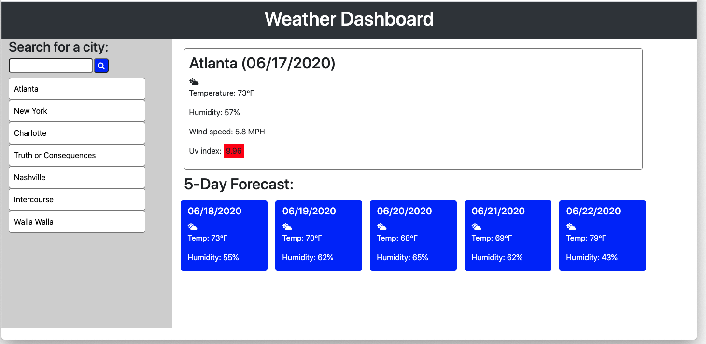

#Weather Dashboard

## Description

This page displays the current weather and forecast of an entered location, as well as clickable entries for previous searches.

## Installation
    
1. pull repo to local machine
2. open index.html

## Usage

[Deployed Site](https://roblingjohn.github.io/gt-homework-06-weatherapp/)

User can enter a city name into the search bar. This brings up the current weather for the stated city, including temperature, humidity, wind speed, and UV index. It also displays the five-day forecast for the given city. The city is then saved along with other previous entries, which are displayed in the sidebar and can be clicked to be brought up again.

## Credits

This page was created and coded by John Robling. CSS provided by Bootstrap (http://getbootstrap.com). Time elements provided by moment.js (https://momentjs.com/). Icons provided by Font Awesome (https://fontawesome.com/)